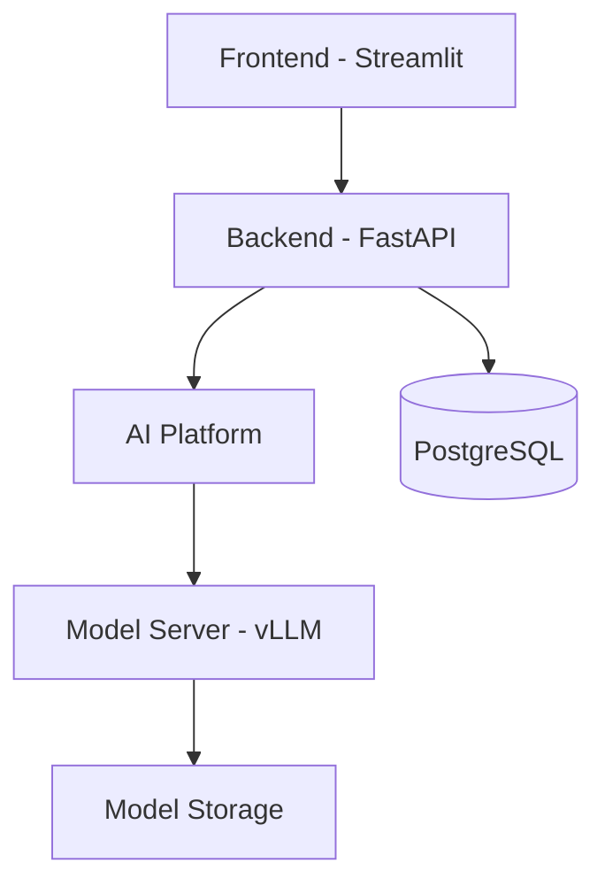
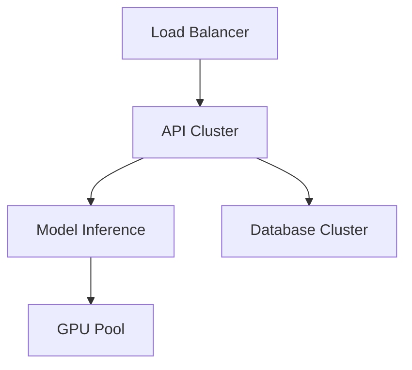

# Design Document: ML-Powered Resume Screening System for HR Luna Park

## Table of Contents

1. [Business Task Definition](#1-business-task-definition)
   1. [Business Problem Statement](#11-business-problem-statement)
   2. [Success Criteria](#12-success-criteria)
   3. [Business Requirements](#13-business-requirements)
   4. [Typical Use Cases](#14-typical-use-cases)
2. [Technical Task Definition](#2-technical-task-definition)
   1. [Technical Problem Formulation](#21-technical-problem-formulation)
   2. [Quality Metrics and Success Criteria](#22-quality-metrics-and-success-criteria)
   3. [Solution Architecture Diagram](#23-solution-architecture-diagram)
   4. [Solution Implementation Stages](#24-solution-implementation-stages)
   5. [Data Description](#25-data-description)
3. [Project Productionization](#3-project-productionization)
   1. [Technical Architecture Diagram](#31-technical-architecture-diagram)
   2. [Infrastructure Description](#32-infrastructure-description)
   3. [Technical Requirements](#33-technical-requirements)
4. [Quality Characteristics](#4-quality-characteristics)
   1. [System Scalability](#41-system-scalability)
   2. [Performance Requirements](#42-performance-requirements)
   3. [System Reliability](#43-system-reliability)
   4. [Model Retraining / Automated Model Replacement](#44-model-retraining--automated-model-replacement)
   5. [Load Testing Results](#45-load-testing-results)
   6. [Future System Extensions](#46-future-system-extensions)

## 1. Business Task Definition

### 1.1 Business Problem Statement

HR Luna Park seeks to enhance its recruitment process by automating the initial resume screening phase. The current manual process is time-consuming, inconsistent, and heavily reliant on individual recruiters' expertise. 

Each candidate's application must pass through multiple stakeholders – first the recruiter for initial screening, then various technical experts who need to evaluate specific skills for different vacancies. This multi-stage manual review creates significant bottlenecks, as technical experts must balance their primary roles with timely candidate evaluations. 

The process becomes particularly challenging when managing multiple open positions simultaneously, as experts need to accurately rank candidates across different vacancies while maintaining quick turnaround times. This leads to delays in the hiring process and risks losing top talent to competitors who can move faster.

The current pipeline's manual nature makes it fundamentally unscalable as the company grows. With HR Luna Park's expansion plans, the volume of applications is expected to increase, making it impossible to maintain quality and speed with the existing process. Technical experts are already at capacity, and hiring additional experts solely for resume screening is not cost-effective. The AI-powered system is therefore crucial not just for optimization, but as an enabler for the company's growth strategy - allowing the screening process to scale linearly with application volume while maintaining consistent quality and quick turnaround times.

### 1.2 Success Criteria

- Reduce resume screening time.
- Achieve the particular agreement rate with expert recruiters in identifying unsuitable candidates (crucial for reducing expert workload).
- Achieve the particular agreement rate with expert recruiters for candidate ranking.
- Increase daily candidate processing capacity per recruiter by 100% (from average `20` to `40` candidates per day).

### 1.3 Business Requirements

1. Automated Resume Processing
   - Parse multiple document formats (PDF, DOCX, *LinkedIn profile*).
   - Extract relevant information about the candidate automatically.
   - Handle multilingual resumes (English, Russian, Ukranian).

2. Intelligent Matching
   - Match candidates to job requirements.
   - Score candidates based on skills and experience needed for the particular vacancy.
   - Provide explainable results in natural language.
   - Process all data using locally deployed open-source models only, as sending candidate PII to third-party LLM services (like OpenAI) is prohibited for data privacy reasons.

### 1.4 Typical Use Cases

1. **Individual Candidate Assessment**
   - Input: 
     - Candidate information (LinkedIn profile URL, resume PDF, or text description)
     - Target position requirements
   - Process: 
     - Automatic parsing and analysis
     - Skill matching and experience evaluation
   - Output:
     - Numerical score (0-100)
     - Detailed natural language explanation of the score
     - Specific strengths and potential gaps relative to the position

2. **Automated Batch Analysis**
   - Input:
     - Collection of candidate profiles accumulated over time
     - Position requirements
   - Process:
     - Batch processing and comparative analysis
     - Statistical evaluation across all candidates
   - Output:
     - Ranked list of candidates
     - Individual scores and explanations
     - Aggregate statistics and trends
     - Summary of top candidates with comparative strengths

3. **API Integration**
   - Description:
     - RESTful API endpoints for external system integration
     - Comprehensive API documentation with OpenAPI/Swagger
     - Authentication using API keys or OAuth2
    
   - Example Endpoints:
     <details>
       <summary>Click to expand</summary>

       ```json
       POST /api/v1/match
       {
         "vacancy_description": "We are looking for a Senior Backend Developer with 5+ years of experience in Python, FastAPI, and PostgreSQL. The role is remote-friendly and requires strong system design skills.",
         "candidate_description": "Senior software engineer with 7 years of experience in web development. Expert in Python, having built multiple production services using FastAPI. Familiar with PostgreSQL through side projects. Contributed to open-source projects and mentored junior developers.",
         "predictor_type": "lm",
         "predictor_parameters": {
           "api_base_url": "http://localhost:1234/v1",
           "model": "mistral-7b-instruct"
         }
       }
       ```

     </details>
   - Example Response:
     <details>
       <summary>Click to expand</summary>

     ```json
     {
       "score": 85.5,
       "description": "Strong match for the Senior Backend Developer position. Key strengths: 7 years of Python development experience and extensive FastAPI usage in production. Areas for consideration: PostgreSQL experience is limited to side projects rather than production systems. Overall, the candidate's technical expertise and experience level align well with the core requirements."
     }
     ```
     </details>


## 2. Technical Task Definition

### 2.1 Technical Problem Formulation

The project involves two main ML tasks:

1. **Resume-Job Matching**: 
   - Similarity scoring system matching resume content with job requirements
   - Text embedding and semantic comparison
   - Skills and experience extraction and validation

2. **Success Prediction**:
   - Binary classification for candidate success prediction
   - Multi-stage prediction for interview process outcomes
   - Probability scoring for hiring likelihood

### 2.2 Quality Metrics and Success Criteria

| Metric | Target | Measurement Method |
|--------|---------|-------------------|
| Model Accuracy | ≥ 85% | Compare with expert ratings |
| False Positive Rate | ≤ 15% | Track incorrect recommendations |
| Response Time | ≤ 2 seconds | API endpoint monitoring |
| System Uptime | ≥ 99.9% | Infrastructure monitoring |

### 2.3 Solution Architecture Diagram



### 2.4 Solution Implementation Stages

1. **Data Collection & ETL**
   - Historical resume processing
   - Data standardization
   - Label collection and validation

2. **Feature Engineering**
   ```python
   def process_resume(text):
       # Remove PII
       text = remove_personal_info(text)
       # Extract key sections
       sections = extract_sections(text)
       # Generate embeddings
       embeddings = bert_model.encode(text)
       return create_feature_vector(sections, embeddings)
   ```

3. **Model Development Phases**
   - MVP: Basic classification
   - Advanced: BERT-based matching
   - Production: Ensemble approach

### 2.5 Data Description

| Data Type | Source | Volume | Update Frequency |
|-----------|--------|--------|------------------|
| Resumes | ATS System | 50K/year | Daily |
| Job Descriptions | HR Database | 1K/year | Weekly |
| Interview Outcomes | Feedback System | 20K/year | Real-time |

## 3. Project Productionization

### 3.1 Technical Architecture Diagram



### 3.2 Infrastructure Description

1. **Compute Resources**
   - API Servers: 4x t2.large
   - Model Servers: 2x g4dn.xlarge
   - Database: RDS r5.large

2. **Storage Requirements**
   - Model Artifacts: 100GB
   - Document Storage: 500GB/year
   - Database: 1TB with replication

### 3.3 Technical Requirements

1. **Performance**
   - Latency: < 2s per request
   - Throughput: 100 requests/second
   - Concurrent Users: 50

2. **Security**
   - Data Encryption at rest
   - HTTPS/TLS
   - Role-based access control

## 4. Quality Characteristics

### 4.1 System Scalability

- Horizontal scaling of API servers
- Auto-scaling based on load
- Database read replicas
- Distributed model inference

### 4.2 Performance Requirements

| Component | Metric | Target |
|-----------|--------|--------|
| API Response | P95 Latency | < 2s |
| Model Inference | Batch Processing | 50 resumes/s |
| Database | Query Response | < 100ms |

### 4.3 System Reliability

- High Availability: 99.9% uptime
- Automated failover
- Regular backups
- Error monitoring and alerting

### 4.4 Model Retraining / Automated Model Replacement

1. **Monitoring Triggers**
   - Performance degradation
   - Data drift detection
   - Weekly evaluation cycles

2. **Retraining Pipeline**
   - Automated data collection
   - A/B testing framework
   - Shadow deployment

### 4.5 Load Testing Results

| Concurrent Users | Response Time (ms) | Error Rate (%) |
|-----------------|-------------------|----------------|
| 10 | 150 | 0 |
| 50 | 300 | 0.1 |
| 100 | 600 | 0.5 |
| 500 | 1200 | 2.0 |

### 4.6 Future System Extensions

1. **Enhanced Features**
   - Multi-language support
   - Video interview integration
   - Automated reference checking

2. **Technical Improvements**
   - Real-time processing
   - Advanced analytics dashboard
   - Integration with additional HR systems

