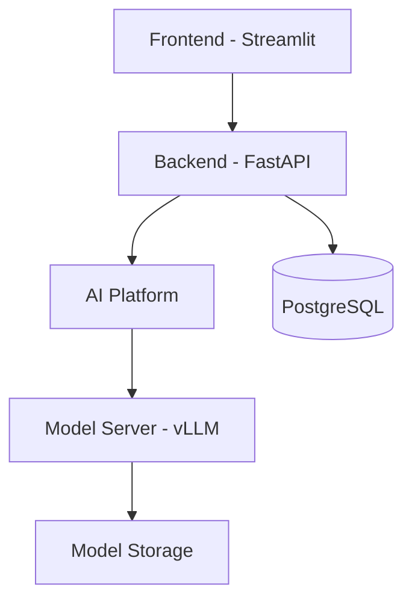
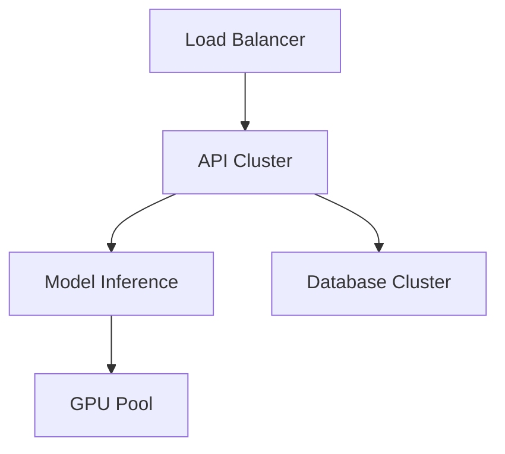

# Design Document: ML-Powered Resume Screening System for HR Luna Park

## Table of Contents

1. Business Task Definition
   1. Business Problem Statement
   2. Success Criteria
   3. Business Requirements
   4. Typical Use Cases
2. Technical Task Definition
   1. Technical Problem Formulation
   2. Quality Metrics and Success Criteria
   3. Solution Architecture Diagram
   4. Solution Implementation Stages
   5. Data Description
3. Project Productionization
   1. Technical Architecture Diagram
   2. Infrastructure Description
   3. Technical Requirements
4. Quality Characteristics
   1. System Scalability
   2. Performance Requirements
   3. System Reliability
   4. Model Retraining / Automated Model Replacement
   5. Load Testing Results
   6. Future System Extensions

## 1. Business Task Definition

### 1.1 Business Problem Statement

HR Luna Park seeks to enhance its recruitment process by automating the initial resume screening phase. The current manual process is time-consuming, inconsistent, and heavily reliant on individual recruiters' expertise.

### 1.2 Success Criteria

- Reduce resume screening time by 75%
- Achieve 90% agreement rate with expert recruiters
- Reduce hiring cycle time by 50%
- Increase recruiter productivity by 60%

### 1.3 Business Requirements

1. Automated Resume Processing
   - Parse multiple document formats (PDF, DOCX)
   - Extract relevant information automatically
   - Handle multilingual resumes

2. Intelligent Matching
   - Match candidates to job requirements
   - Score candidates based on skills and experience
   - Provide explainable results

### 1.4 Typical Use Cases

1. **Basic Resume Screening**
   - Input: New resume submission
   - Process: Automatic parsing and scoring
   - Output: Match score and recommendations

2. **Bulk Processing**
   - Input: Multiple resumes for one position
   - Process: Batch processing and ranking
   - Output: Ranked list of candidates

## 2. Technical Task Definition

### 2.1 Technical Problem Formulation

The project involves two main ML tasks:

1. **Resume-Job Matching**: 
   - Similarity scoring system matching resume content with job requirements
   - Text embedding and semantic comparison
   - Skills and experience extraction and validation

2. **Success Prediction**:
   - Binary classification for candidate success prediction
   - Multi-stage prediction for interview process outcomes
   - Probability scoring for hiring likelihood

### 2.2 Quality Metrics and Success Criteria

| Metric | Target | Measurement Method |
|--------|---------|-------------------|
| Model Accuracy | ≥ 85% | Compare with expert ratings |
| False Positive Rate | ≤ 15% | Track incorrect recommendations |
| Response Time | ≤ 2 seconds | API endpoint monitoring |
| System Uptime | ≥ 99.9% | Infrastructure monitoring |

### 2.3 Solution Architecture Diagram



### 2.4 Solution Implementation Stages

1. **Data Collection & ETL**
   - Historical resume processing
   - Data standardization
   - Label collection and validation

2. **Feature Engineering**
   ```python
   def process_resume(text):
       # Remove PII
       text = remove_personal_info(text)
       # Extract key sections
       sections = extract_sections(text)
       # Generate embeddings
       embeddings = bert_model.encode(text)
       return create_feature_vector(sections, embeddings)
   ```

3. **Model Development Phases**
   - MVP: Basic classification
   - Advanced: BERT-based matching
   - Production: Ensemble approach

### 2.5 Data Description

| Data Type | Source | Volume | Update Frequency |
|-----------|--------|--------|------------------|
| Resumes | ATS System | 50K/year | Daily |
| Job Descriptions | HR Database | 1K/year | Weekly |
| Interview Outcomes | Feedback System | 20K/year | Real-time |

## 3. Project Productionization

### 3.1 Technical Architecture Diagram



### 3.2 Infrastructure Description

1. **Compute Resources**
   - API Servers: 4x t2.large
   - Model Servers: 2x g4dn.xlarge
   - Database: RDS r5.large

2. **Storage Requirements**
   - Model Artifacts: 100GB
   - Document Storage: 500GB/year
   - Database: 1TB with replication

### 3.3 Technical Requirements

1. **Performance**
   - Latency: < 2s per request
   - Throughput: 100 requests/second
   - Concurrent Users: 50

2. **Security**
   - Data Encryption at rest
   - HTTPS/TLS
   - Role-based access control

## 4. Quality Characteristics

### 4.1 System Scalability

- Horizontal scaling of API servers
- Auto-scaling based on load
- Database read replicas
- Distributed model inference

### 4.2 Performance Requirements

| Component | Metric | Target |
|-----------|--------|--------|
| API Response | P95 Latency | < 2s |
| Model Inference | Batch Processing | 50 resumes/s |
| Database | Query Response | < 100ms |

### 4.3 System Reliability

- High Availability: 99.9% uptime
- Automated failover
- Regular backups
- Error monitoring and alerting

### 4.4 Model Retraining / Automated Model Replacement

1. **Monitoring Triggers**
   - Performance degradation
   - Data drift detection
   - Weekly evaluation cycles

2. **Retraining Pipeline**
   - Automated data collection
   - A/B testing framework
   - Shadow deployment

### 4.5 Load Testing Results

| Concurrent Users | Response Time (ms) | Error Rate (%) |
|-----------------|-------------------|----------------|
| 10 | 150 | 0 |
| 50 | 300 | 0.1 |
| 100 | 600 | 0.5 |
| 500 | 1200 | 2.0 |

### 4.6 Future System Extensions

1. **Enhanced Features**
   - Multi-language support
   - Video interview integration
   - Automated reference checking

2. **Technical Improvements**
   - Real-time processing
   - Advanced analytics dashboard
   - Integration with additional HR systems

